# Customer Service Analysis with Microsoft Fabric
This GitHub Repo intends to give an example and walkthrough guide how to use Microsoft Fabric. We look at a end to end scenario of getting insights into the performance by using the sample dataset from Kaggle [Call Center Data from Kaggle](https://www.kaggle.com/datasets/satvicoder/call-center-data?resource=download)

###### Disclaimer: In order to replicate this analysis, you need to either use a paid Fabric capacity or sign up for a [Microsoft Fabric Trial](https://learn.microsoft.com/en-us/fabric/get-started/fabric-trial)

[Microsoft Fabric Blog Announcement](https://azure.microsoft.com/en-us/blog/introducing-microsoft-fabric-data-analytics-for-the-era-of-ai/)
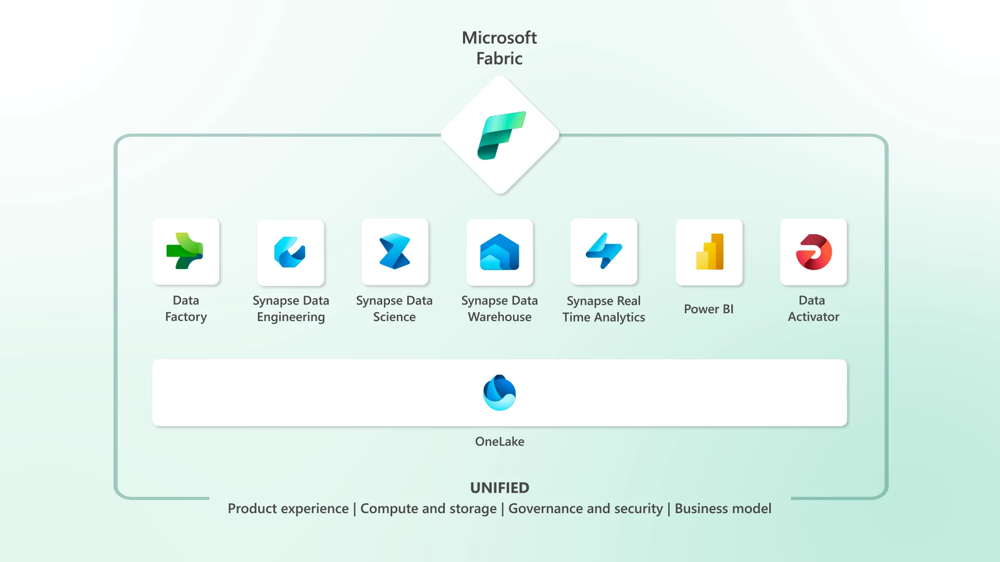

Microsoft Fabric is in General Availability since November 2023 and is built on existing Microsoft Analytics technologies but went through heavy re-design and re-engineering along with innovation additions. This SaaS product enables end-to-end data & analytics scenarios in one unified product. From data integration, data pre-processing and engineering to data science, real-time analysis and business intelligence, Fabric enables users with different backgrounds to collaborate in a no-/low-code and pro developer environment. By "switching" between different workloads within Fabric, each user can perform a specific task to contribute to the overall holistic analysis use case. For example for data integration and ETL, the Data Factory experience in Fabric comes into play, whereas for transforming data in a Spark Notebook environment, a user would switch to the Data Engineering page. OneLake is the foundation for all data being used and artifacts created in Fabric as it serves as the storage layer. All data is stored in the open source Delta Parquet format and all the engines (TSQL, Spark, Analysis Services, KQL) were being revamped to natively process this file format. So no data duplication or transformation is necessary when different teams want to work on the same data with different skills. 

## Let's look at a concrete example that can be found cross-industry: Customer Service Performance
We want to look closer into such an end-to-end scenario and understand, how several users with different skillsets get engaged. Say suppose an organization is selling B2C products and offers customer service support for whatever inquiry, support or complaint the end user might face and want to get into touch with the company. There are different ways how the customer can get in contact with the company's customer service team: via social media, email, chat or phone calls, so the company gathers a lot of data from various sources in different file formats. The goal for the company is to improve customer service performance and increase therefore customer satisfaction. The first important step for analyzing the support performance is to consolidate all the data that can be gathered across the interactions with the customer in one place. This one place in our example is OneLake in Microsoft Fabric, which is an optimized storage for big data analytics workloads, supporting structured, semi-/and un-structured file formats.

To simplify, this example will only take into consideration one csv file, the sample data set [Call Center Data from Kaggle](https://www.kaggle.com/datasets/satvicoder/call-center-data?resource=download)

## How does the workflow look like
1) A data engineer or someone from the enterprise analytics team would integrate data from various sources into one place, landing the data in a bronze/raw zone in a Lakehouse by leveraging the data integration features of Microsoft Fabric Data Factory (following the Medallion architecture for Data Analysis)
2) The data engineer would continue working in the Lakehouse to create a Spark Notebook and start performing some Exploratory Data Analysis (EDA) on the data to better understand the content and if there is the need to clean it or handle missing data (in the example the csv file). In this step, data pre-processing and saving it in a silver/curated layer inside of the Lakehouse could be a common step.
3) Now the business analyst would like to visually explore the data and build a PowerBI Report. For this, a quick look at the file stored in the silver layer reveals, that some further data transformation is necessary to create for example new columns or measures that might be helpful in the report. Switching to the Data Factory workload again and leveraging the Dataflows gen2 feature for no-/low-code development supports preparing the data for BI and saving it into the gold/curated layer of the Lakehouse.
4) Finally, with a cleaned and processed dataset, the business analyst or also business user from any company domain can start creating a PowerBI report by using the PowerBI workload inside of Fabric.

<!--- ## Prerequisites
- You need a Microsoft Fabric subscription or sign up for a free [Microsoft Fabric (Preview) trial](https://learn.microsoft.com/en-gb/fabric/enterprise/licenses)
- Sign in to [Microsoft Fabric](https://fabric.microsoft.com/)
- Use an existing Microsoft Fabric Lakehouse or create a new once by following the steps in this [tutorial](https://learn.microsoft.com/en-gb/fabric/data-engineering/create-lakehouse)

## Step by Step guide for customer service analysis
### 1. Load Data 
Data Engineers can use the [Data Factory](https://learn.microsoft.com/en-us/fabric/get-started/fabric-trial) feature inside of Fabric to ingest, prepare and transform data from other sources and land it into OneLake. In our example, we will upload a local file directly into the Lakehouse

In Fabric, navigate to the Data Engineering experience by clicking on the icon at the bottom left (hint: this is where you switch between all different workloads). I created the "CallCenter_LH" for our example. With the filter button on the right, you can speed up searching for specific artifacts in Fabric. I selected "Lakehouse" to only get listed all Lakehouses I created.
     
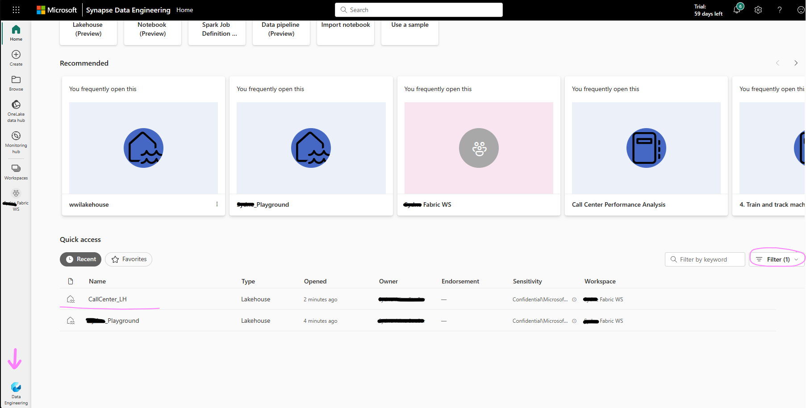

Find under the Home Tab "Get Data" and select "Upload files" as shown in the screenshot below. Continue with uploading the [Call Center dataset](https://www.kaggle.com/datasets/satvicoder/call-center-data?resource=download) from Kaggle
     
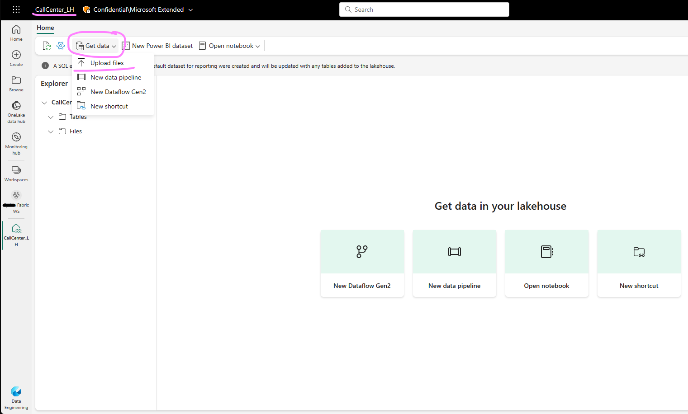

Verify that the data is uploaded successuflly by clicking the "Refresh" icon and locate the csv file under the "Files" section. As the file is in csv format, it is stored under the "Files" section vs the "table" section. The File section can contains various file formats like csvs, images, parquet and more. The "Table" section contains refined and consolidated data that is ready for business analysis in the delta parquet format.


   
### 2. Process Data
Once the data is uploaded, it can be used and processed by other engines within Fabric, e.g. the SQL engine in the Data Warehouse workload or the KQL engine in the Real-Time Analytics workload etc. For example, merging and pre-processing different dataset can be achieved with code in a Spark Notebook inside the [Synapse Data Engineering experience](https://learn.microsoft.com/en-us/fabric/data-engineering/data-engineering-overview) and/or via the no-/low-code approach of Data Flows Gen2 insith the [Data Factory workload](https://learn.microsoft.com/en-us/fabric/data-factory/create-first-dataflow-gen2). We will first process the csv file of "File" section and then load it into a table into the "Table" section with a Spark Notebook. 

Create a Notebook

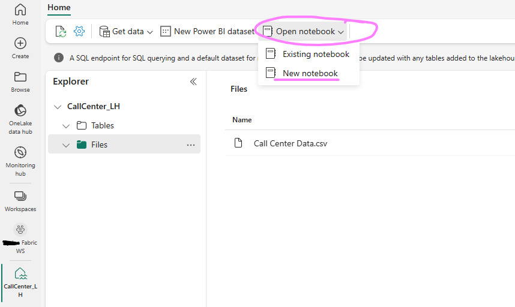

Make sure your Lakehouse is attached and you selected PySpark (Python) as the language


Insert and run the following code

```Python
#import pandas and read the call center csv file from the Lakehouse
import pandas as pd

cc = pd.read_csv("/lakehouse/default/" + "Files/Call Center Data.csv")
cc.head(5)

#renaming columns to exclude spaces
cc = cc.rename(columns= {"Incoming Calls": "incoming_calls", "Answered Calls": "answered_calls", "Answer Rate": "answer_rate", "Abandoned Calls": "abandoned_calls", "Answer Speed (AVG)": "answer_speed_avg", "Talk Duration (AVG)": "talk_duration_avg", "Waiting Time (AVG)": "waiting_time_avg", "Service Level (20 Seconds)": "servicel_level_20s"})

#drop Index column as it is unnecessary for further analysis in this case
cc = cc.drop(columns= ["Index"])

# Convert the columns with datetime information to datetime values 
cc_time = cc.copy()
cc_time[["answer_speed_avg", "talk_duration_avg", "waiting_time_avg"]] = cc_time[["answer_speed_avg", "talk_duration_avg", "waiting_time_avg"]].apply(pd.to_datetime, errors= "coerce")

#Create Spark Dataframe and write it back to the Lakehouse Tables section for PBI reporting later on
sparkDF = spark.createDataFrame(cc_time)
sparkDF.write.mode("overwrite").format("delta").save("Tables/" + "callcenter_processed")
```

Verify that the file was succeffully written in the table section by clicking on the three dots next to "Tables" and hit "Refresh"

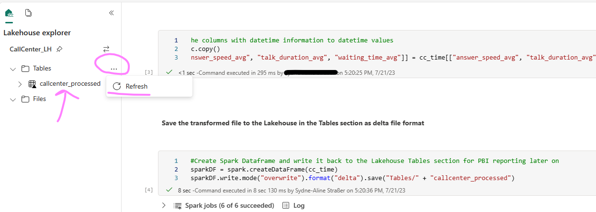

### 3. Perform some Exploratory Data Analysis
Let's continue with some EDA to better understand the data and retrieve some insights. You can stay in the current notebook, add the following code and run it:

```Python
#check the data types to get an overview
cc_time.dtypes

#check for null values
cc_time.isnull().sum()

#Converting datetime values into decimals for the hours, minutes, and seconds in order to have useable statistical (float) data 
cc_timefloat = cc_time.copy()
cc_timefloat['answer_speed_avg'] =  cc_timefloat['answer_speed_avg'].dt.hour * 60 + cc_timefloat['answer_speed_avg'].dt.minute + cc_timefloat['answer_speed_avg'].dt.second/60
cc_timefloat['talk_duration_avg'] = cc_timefloat['talk_duration_avg'].dt.hour * 60 + cc_timefloat['talk_duration_avg'].dt.minute + cc_timefloat['talk_duration_avg'].dt.second/60
cc_timefloat['waiting_time_avg'] = cc_timefloat['waiting_time_avg'].dt.hour * 60 + cc_timefloat['waiting_time_avg'].dt.minute + cc_timefloat['waiting_time_avg'].dt.second/60

#create a correlation matrix to understand how the parameters impact each other
import seaborn as sns
from matplotlib import pyplot as plt
plt.figure(figsize=(15,10)) 
sns.color_palette("dark", as_cmap=True)
sns.heatmap(cc_timefloat.corr(), annot=True, cmap='coolwarm', center = 0)

```
### 4. Data Transformation with DataFlow Gen2 
We will now make use of the no-/low-code ETL feature inside of "Data Factory" to create a new column. Navigate on the bottom left to the Data Factory workload and click on new DataFlow Gen2

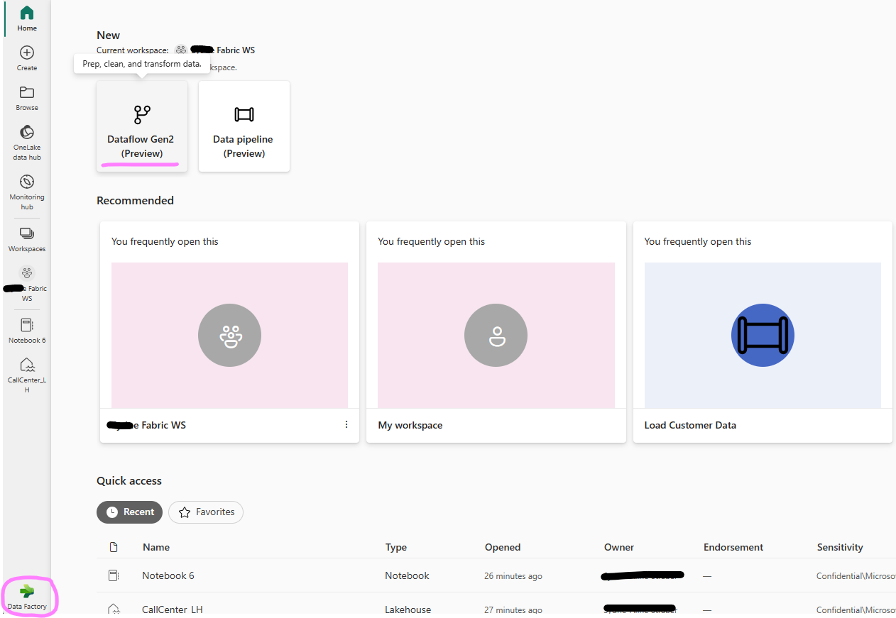

Now we need to connect to our call center data we stored in the Table section in our Lakehouse. Click on "get data from a different source"

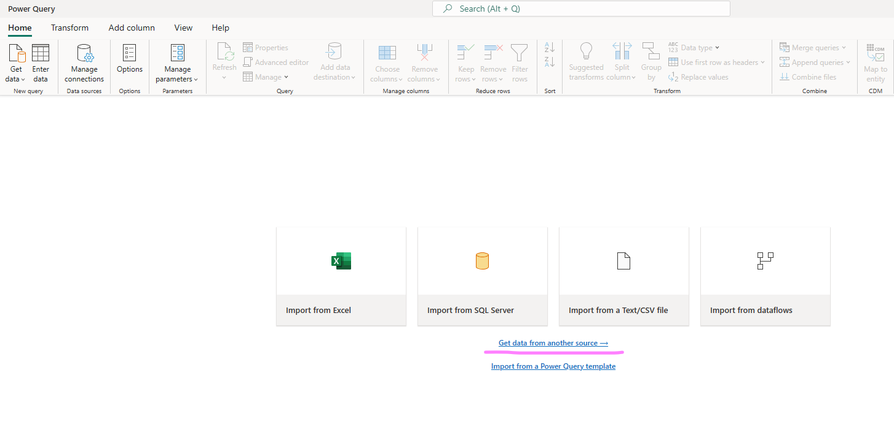

Type in the search bar "Lakehouse" and click on the Lakehouse beta connector. Use the authentication kind "Organizational Account", sign in and click next.

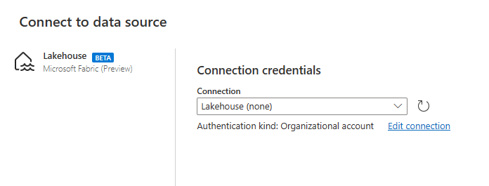

Navigate on the left to your Fabric Workspace > your Lakehouse (in my case CallCenter_LH) and select the callcenter_processed dataset and click create

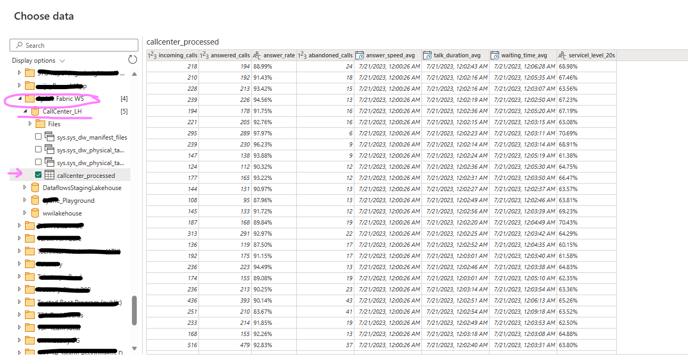

Now, we want to change the data type of the column "answer_rate" to decimal. Right-click on the column name, go to "change type" and click "decimal number". You will see on the right side in the Query settings field, that this step has been added.

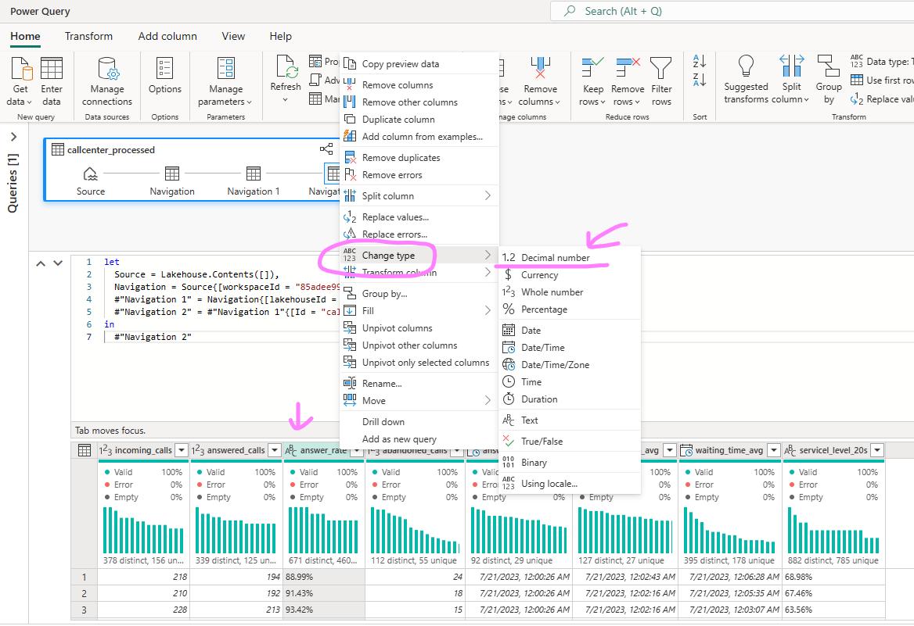

We will create a new column, "answer_rate_bucket", that will assign 4 different categories depending on the input from our column "answer_rate". Navigate at the tab bar to "Add column", then select "custom column" and a window will open. Change the name of the column we want to create to "answer_rate_bucket", change the Type to "Text" and add the following code into the field
```Python
if [answer_rate] >= 0 and [answer_rate] < 0.25 then "0-24%"
    else if [answer_rate] >= 0.25 and [answer_rate] < 0.5 then "25-49%"
    else if [answer_rate] >= 0.5 and [answer_rate] < 0.75 then "50-74%"
    else if [answer_rate] >= 0.75 and [answer_rate] < 1 then "75-99%"
    else if [answer_rate] = 1 then "100%"
    else "Other"
```
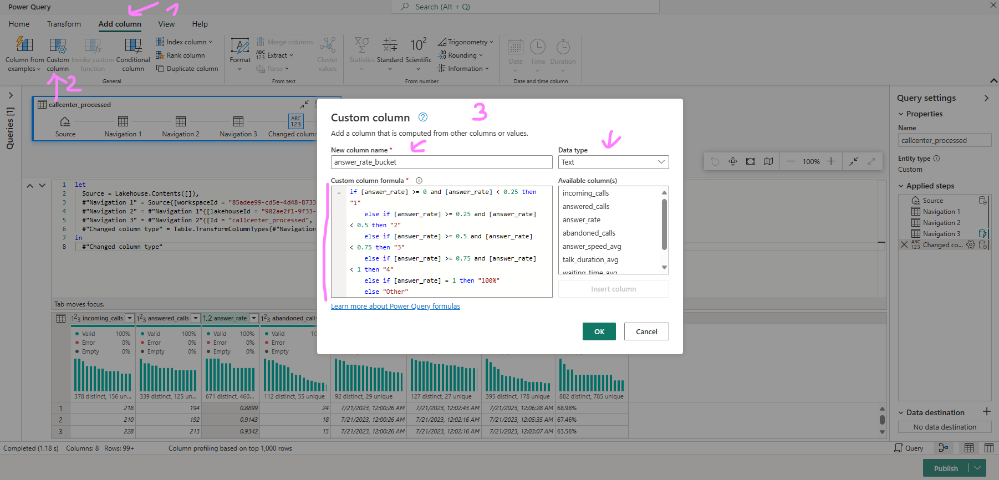

Verify that the step (custom column) has been added to the flow and you can see also the column in the data preview with inputs. Now we bring this data back to the Lakehouse. On the right bottom click to add a data destination and select "Lakehouse"

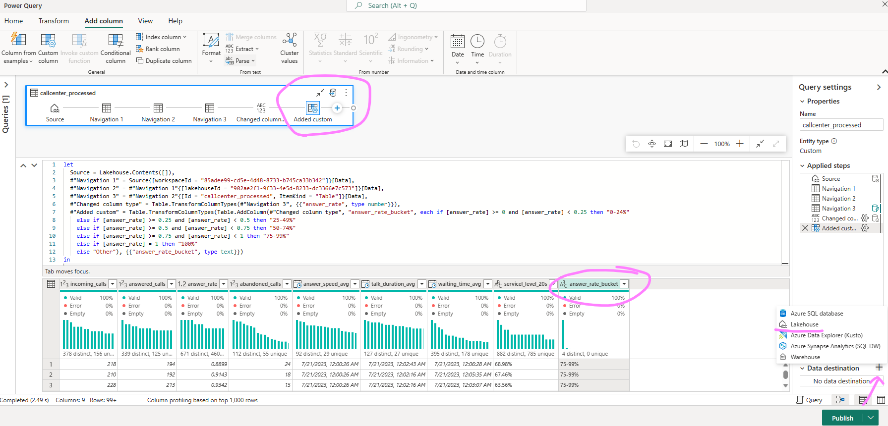

Follow the wizward to authenticate the same way you did for connecting to the data source Lakehouse earlier (beginning of Step 4). Now we will bring the data into a new table in the same Lakehouse but with a different name so we can later on identify the dataset.

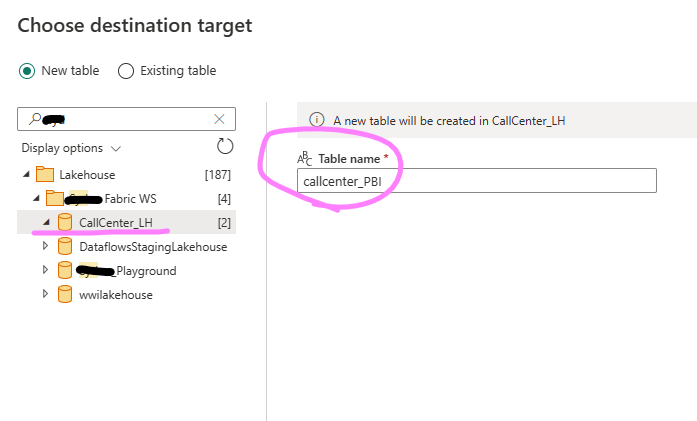

Click on next and keep the settings are they are (Update method = replace) and the source types should be correctly identified. Click on save settings. Back on the Power Query screen, locate on the bottom right the "Publish" button and click to publish now.


### 5. Create PowerBI Report
With Microsoft Fabric PowerBI, a new connection mode has been introduced: [Direct Lake Mode]([https://learn.microsoft.com/en-us/fabric/data-engineering/lakehouse-pbi-reporting](https://learn.microsoft.com/en-us/power-bi/enterprise/directlake-overview)). This capability allows very fast BI visualization on large datasets by loading parquet files directly from the Data Lake into the PBI engine, without the necessity to query a Lakehouse endpoint nor importing data into a PowerBI dataset. In order to create a Direct Lake dataset, we need to go back to our Lakehouse we have been working on in the previous steps (switch back on the left bottom to the Data Engineering icon and select your Lakehouse). From there you should verify that your table transformed in Step 4 with Dataflows Gen2 has been saved. 

Next, click on "New Power BI dataset" and select the table that has been created after Step 4 from the Dataflow transformation (you can verify by spotting the "answer_rate_bucket" column) and click "confirm". 

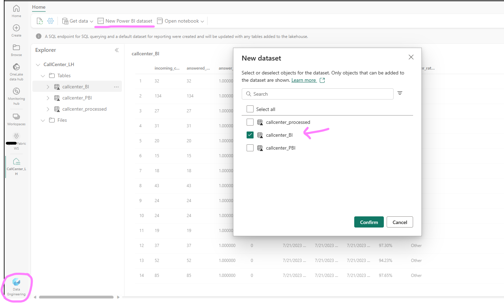

Now we would have the opportunity to do some data modelling and create relationships between several tables. In this case, we skip it as we just have one table and click on "New Report"

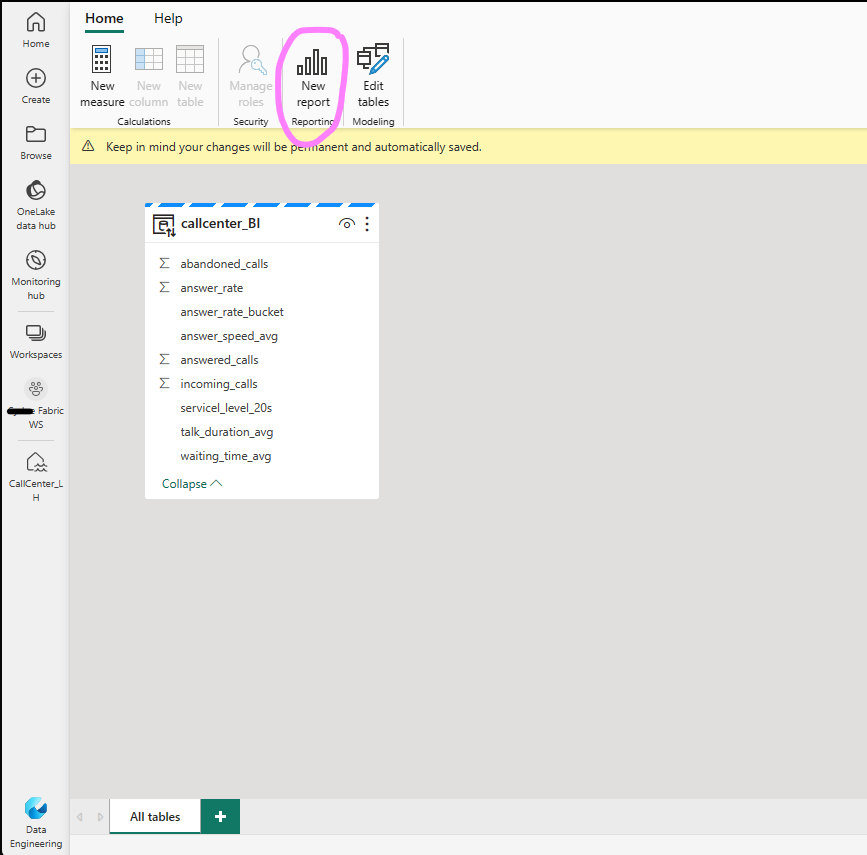

By expanding the table on the right side in PowerBI, you can see all the columns. Just by clicking on "answer_rate_bucket" and "answered calls", automatically a visual table is created. Feel free to explore and create further tiles to explore the data

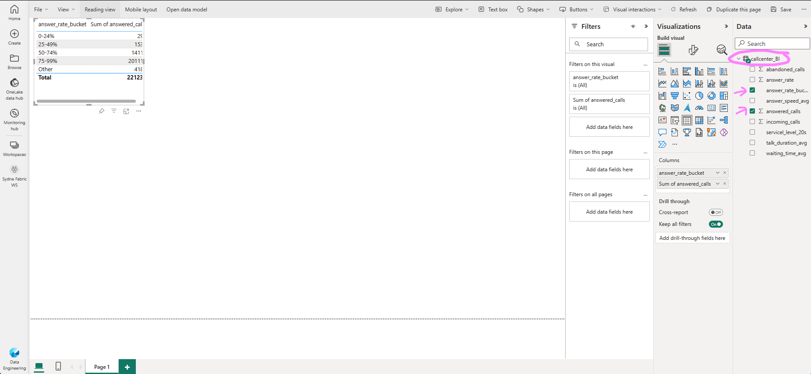 --->

