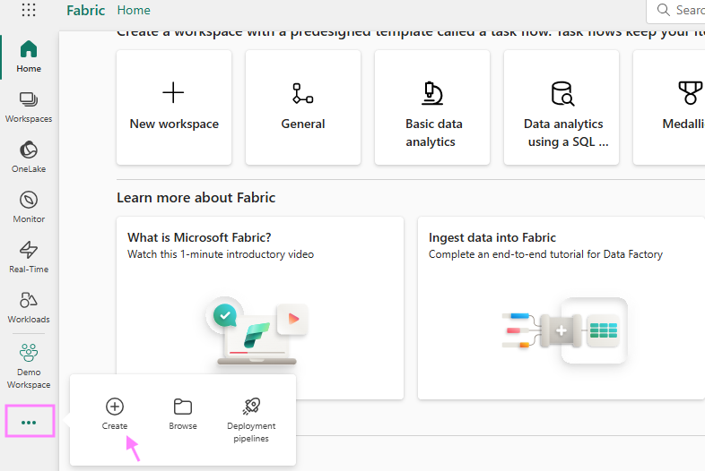
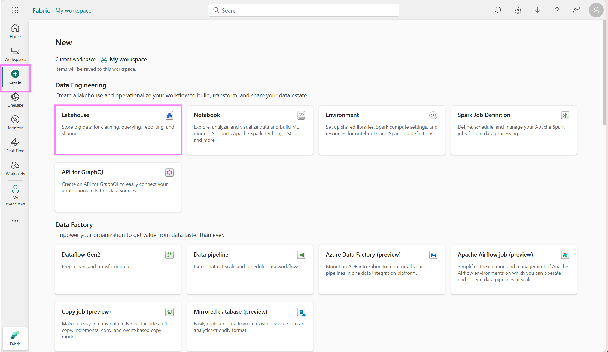
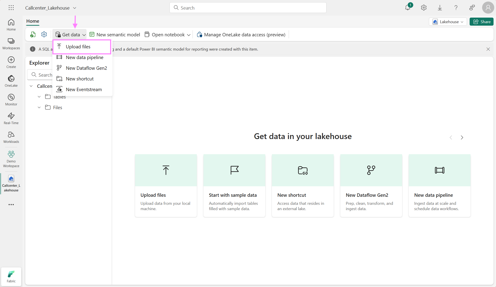
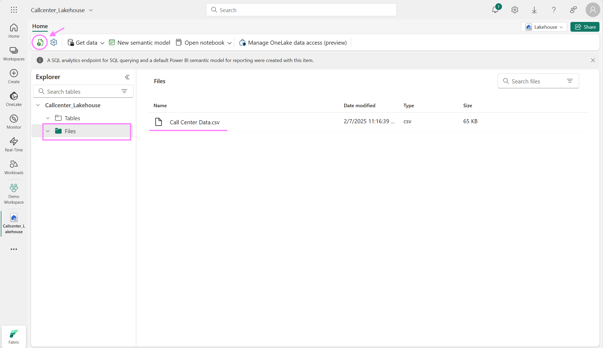

## Step by Step guide for customer service analysis in Microsoft Fabric
### 1. Load Data 
Enter in your web browser of your choice: https://app.fabric.microsoft.com/

Data Engineers commonly use the [Fabric Data Factory](https://learn.microsoft.com/en-us/fabric/data-factory/data-factory-overview) section to ingest, prepare and transform data from various data sources and land it in Fabric OneLake. In our example, we will upload a local file directly into the Lakehouse. If you haven't downloaded the dataset in the prerequisite section yet, download it now to your computer: [Call Center dataset](https://fabricaitourdemocologne.blob.core.windows.net/sample/Call%20Center%20Data.csv).  
Once the data is uploaded, it can be used and processed by other engines within Fabric, e.g. the SQL engine in the Data Warehouse workload or the KQL engine in the Real-Time Intelligence workload etc.

To do this, navigate on the bar on your left and click on "Create" which will open up the page from where you see all items you can create in Fabric. Hint: If you cannot find the "Create" button on your left side navigation bar, check on the three dots, it might be located in there as seen in the following screenshot:

Click on Lakehouse, enter the new name "Callcenter_Lakehouse", leave the "Lakehouse schema" option un-checked and click create.
     

In your Lakehouse, find under the Home Tab "Get Data" and select "Upload files" as shown in the screenshot below. Browse for the folder where you have stored the downloaded file in the prerequisite section of this tutorial and upload it to the Lakehouse. 
     

Verify that the data is uploaded successuflly by clicking the "Refresh" icon on the top left and locate the csv file under the "Files" section. As the file is in csv format, it is stored under the "Files" section instead of the "table" section. The File section can contain various file formats like csvs, images, jsons and more. The "Table" section contains recognized delta parquet tables. To learn more about the file and table section in the Lakehouse check out the [documentation](https://learn.microsoft.com/en-us/fabric/data-engineering/navigate-lakehouse-explorer#main-view-area) 

