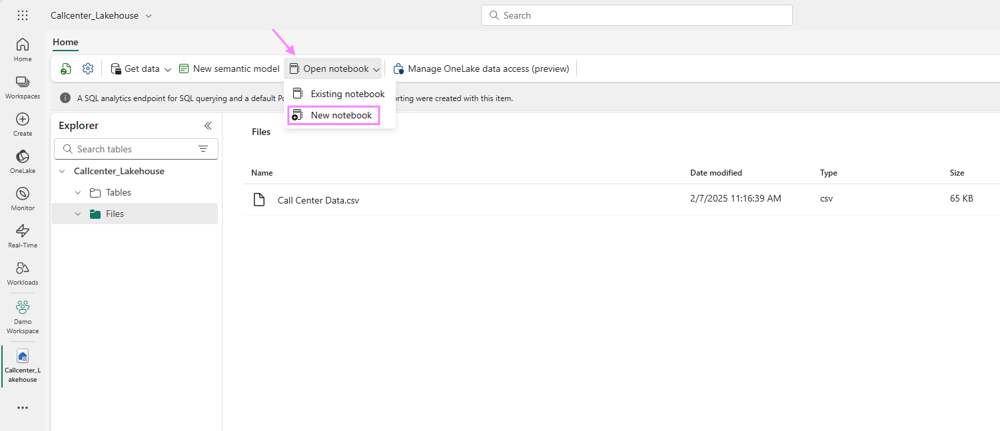
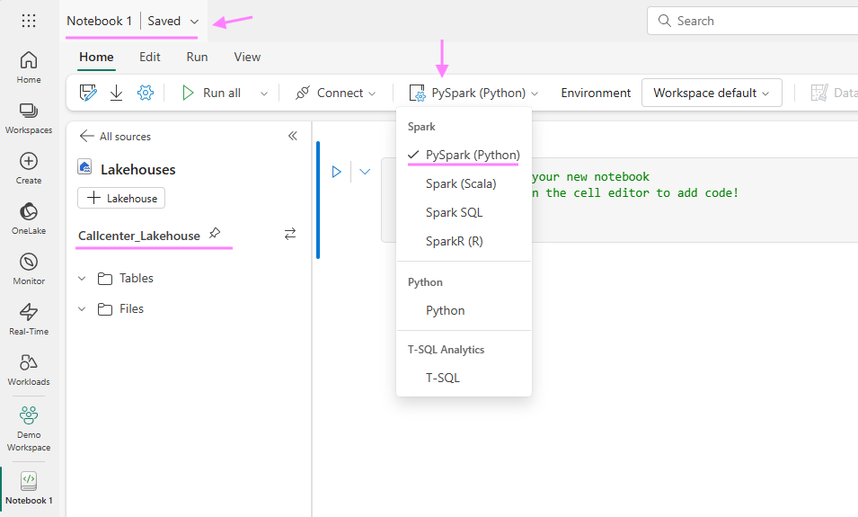
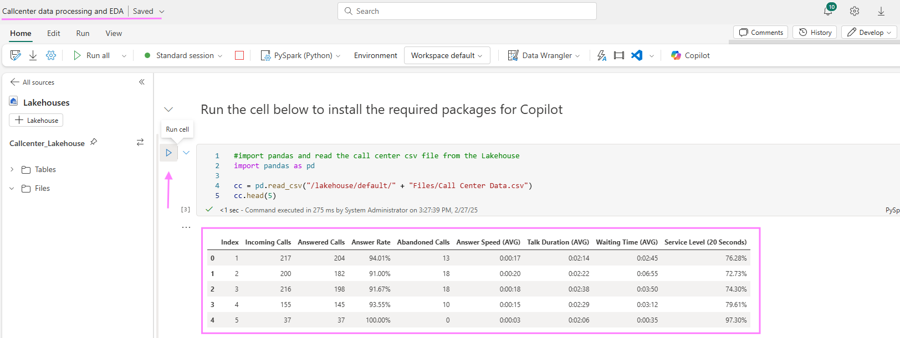
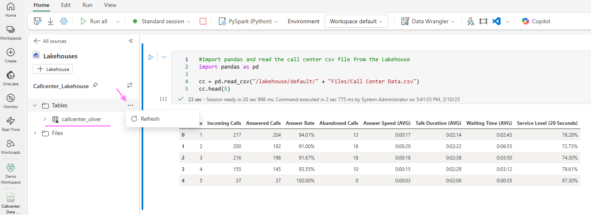

### 2. Pre-process Data
As a very first step, we take a quick look at the csv file, change columns names and save it as a delta parquet table in the same Lakehouse to the "table" section. We will use Python and therefore, from the Lakehouse at the top bar, create a new Notebook that can be utilized for typical Data Engieer tasks.

Create a Notebook



Make sure your Lakehouse "Callcenter_Lakehouse" is attached and you have PySpark (Python) selected as the language in the drop-down menu in the Home Tab options of the Notebook. On the left top corner you will see "Notebook 1" which you can rename to something more meaningful like "Callcenter data processing and EDA"



Insert into the notebook cells and run the following code

```Python
#import pandas and read the call center csv file from the Lakehouse
import pandas as pd

cc = pd.read_csv("/lakehouse/default/" + "Files/Call Center Data.csv")
cc.head(5)
```




Replace the Index column to a Date column with every row being a new day from 1st of Jan 2021 onwards. Rename columns to exclude spaces in column names.
```Python
# Replace the Index column to a Date column with every row being a new day from 1st of Jan 2021 onwards
cc['Index'] = pd.to_datetime(cc['Index'], unit='D', origin='2021-01-01')

#renaming columns to exclude spaces in column names (delta allows now column name spaces and special characters when enabling column mapping on a delta table but we work with dataframes before saving as delta table)
cc = cc.rename(columns= {"Index" : "Date", "Incoming Calls": "incoming_calls", "Answered Calls": "answered_calls", "Answer Rate": "answer_rate_inpct", "Abandoned Calls": "abandoned_calls", "Answer Speed (AVG)": "answer_speed_avg", "Talk Duration (AVG)": "talk_duration_avg", "Waiting Time (AVG)": "waiting_time_avg", "Service Level (20 Seconds)": "servicel_level_20s_inpct"})
```

Remove '%' sign from string values and convert to float datatype for easier analysis later on.
```Python
# Remove '%' sign from string values and convert to float datatype for easier analysis later
cc['answer_rate_inpct'] = cc['answer_rate_inpct'].str.rstrip('%').astype(float)
cc['servicel_level_20s_inpct'] = cc['servicel_level_20s_inpct'].str.rstrip('%').astype(float)
```

Convert columns that contain datetime values from data type object to datetime so we can calculate afterwards easier the seconds.
```Python
#convert columns that contain datetime values from data type object to datetime so we can calculate afterwards easier the seconds
cc['answer_speed_avg'] = pd.to_datetime(cc['answer_speed_avg'], errors='coerce')
cc['talk_duration_avg'] = pd.to_datetime(cc['talk_duration_avg'], errors='coerce')
cc['waiting_time_avg'] = pd.to_datetime(cc['waiting_time_avg'], errors='coerce')

# Convert datetime columns to numercial values and calculate the total seconds
cc['answer_speed_avg'] = cc['answer_speed_avg'].dt.hour * 3600 + cc['answer_speed_avg'].dt.minute * 60 + cc['answer_speed_avg'].dt.second
cc['talk_duration_avg'] = cc['talk_duration_avg'].dt.hour * 3600 + cc['talk_duration_avg'].dt.minute * 60 + cc['talk_duration_avg'].dt.second
cc['waiting_time_avg'] = cc['waiting_time_avg'].dt.hour * 3600 + cc['waiting_time_avg'].dt.minute * 60 + cc['waiting_time_avg'].dt.second
```

We save the Spark dataframe and write it as a delta parquet table back into our Lakehouse.
```Python
#Create Spark Dataframe and write it back to the Lakehouse Tables section for PBI reporting later on
sparkDF = spark.createDataFrame(cc)
sparkDF.write.mode("overwrite").format("delta").save("Tables/" + "callcenter_silver")
```


Verify that the file was succeffully written in the table section by clicking on the three dots next to "Tables" and hit "Refresh". 
Note: if you see a folder underneath "Table" called "Unidentified", select the 2 dots next to it and refresh it, too.


