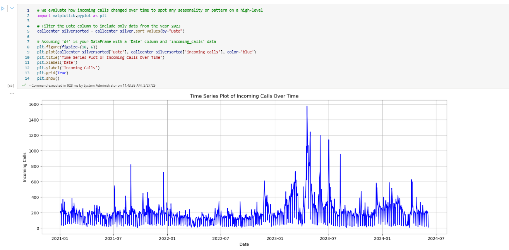

### 3. Perform Exploratory Data Analysis
Let's continue with typical activities of a Data Engineer for Exploratory Data Analysis to better understand the data and retrieve some insights. You can stay in the current notebook you created in step 2 and add the following code blocks in new cells and run each one after the other:

```Python
#let's take a quick look again at our saved delta tables callcenter_silver
callcenter_silver = spark.read.table("callcenter_lakehouse.callcenter_silver").toPandas()
callcenter_silver

#check for null values
callcenter_silver.isnull().sum()

#check the data types to get an overview
callcenter_silver.dtypes

# get a statistic summary over the callcenter_silver table
summary_stats = callcenter_silver.describe()
summary_stats
```

We use common visualizations to detect correlation between the data input we have or patterns we can spot. 
```Python

# create a correlation matrix to see the relationship between all columns
#import the necessary libraries
import seaborn as sns
import matplotlib.pyplot as plt

# Calculate the correlation matrix
corr_matrix = callcenter_silver.corr()

# Plot the correlation matrix using a heatmap
plt.figure(figsize=(10, 8))
sns.heatmap(corr_matrix, annot=True, cmap='coolwarm', fmt=".2f")
plt.title('Correlation Matrix')
plt.show()
```


Let's continue with a time series graph to spot any high-level seasonality or other interesting findings.

```Python
# We evaluate how incoming calls changed over time to spot any seasonality or pattern on a high-level
import matplotlib.pyplot as plt

# Filter the Date column to include only data from the year 2023
callcenter_silversorted = callcenter_silver.sort_values(by="Date")

# Assuming 'df' is your DataFrame with a 'Date' column and 'incoming_calls' data
plt.figure(figsize=(18, 6))
plt.plot(callcenter_silversorted['Date'], callcenter_silversorted['incoming_calls'], color='blue')
plt.title('Time Series Plot of Incoming Calls Over Time')
plt.xlabel('Date')
plt.ylabel('Incoming Calls')
plt.grid(True)
plt.show()
```





