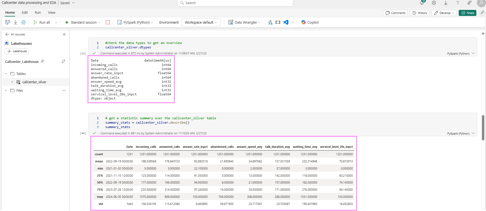
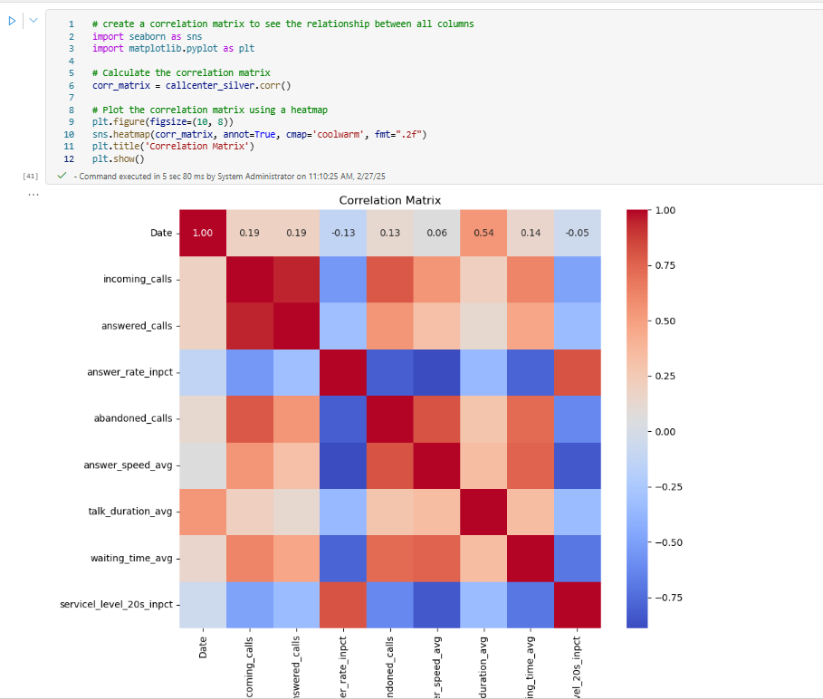

### 3. Perform Exploratory Data Analysis
Let's continue with typical activities of a Data Engineer for Exploratory Data Analysis to better understand the data and retrieve some insights. You can stay in the current notebook you created in step 2 and add the following code blocks in new cells and run each one after the other:

```Python
#let's take a quick look again at our saved delta tables callcenter_silver
callcenter_silver = spark.read.table("callcenter_lakehouse.callcenter_silver").toPandas()
callcenter_silver

#check for null values
callcenter_silver.isnull().sum()

#check the data types to get an overview
callcenter_silver.dtypes

# get a statistic summary over the callcenter_silver table
summary_stats = callcenter_silver.describe()
summary_stats

# create a correlation matrix to see the relationship between all columns
import seaborn as sns
import matplotlib.pyplot as plt
# Calculate the correlation matrix
corr_matrix = callcenter_silver.corr()
# Plot the correlation matrix using a heatmap
plt.figure(figsize=(10, 8))
sns.heatmap(corr_matrix, annot=True, cmap='coolwarm', fmt=".2f")
plt.title('Correlation Matrix')
plt.show()

#let's check how the increasing incoming calls volume impacts the number of abandoned calls and the average waiting time
import plotly.express as px
# Scatterplot for Incoming Calls vs. Abandoned Calls
fig1 = px.scatter(callcenter_relevant, x='incoming_calls', y='abandoned_calls', title='Incoming Calls vs. Abandoned Calls')
fig1.update_traces(marker=dict(size=5))
# Scatterplot for Incoming Calls vs. Average Wait Time
fig2 = px.scatter(callcenter_relevant, x='incoming_calls', y='waiting_time_avg', title='Incoming Calls vs. Average Wait Time')
fig2.update_traces(marker=dict(size=5))
fig1.show()
fig2.show()
```

After you ran cell by cell, your output could look like this:







