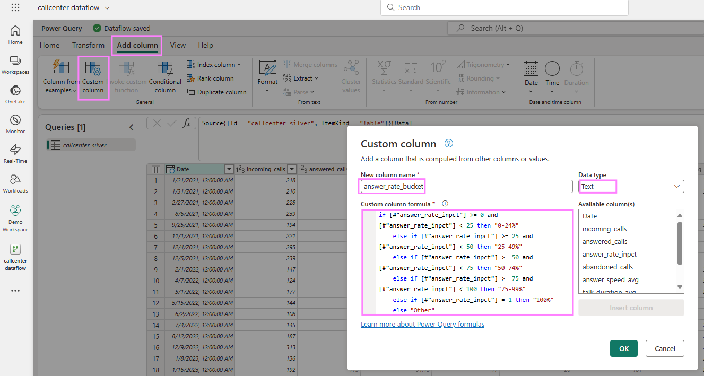
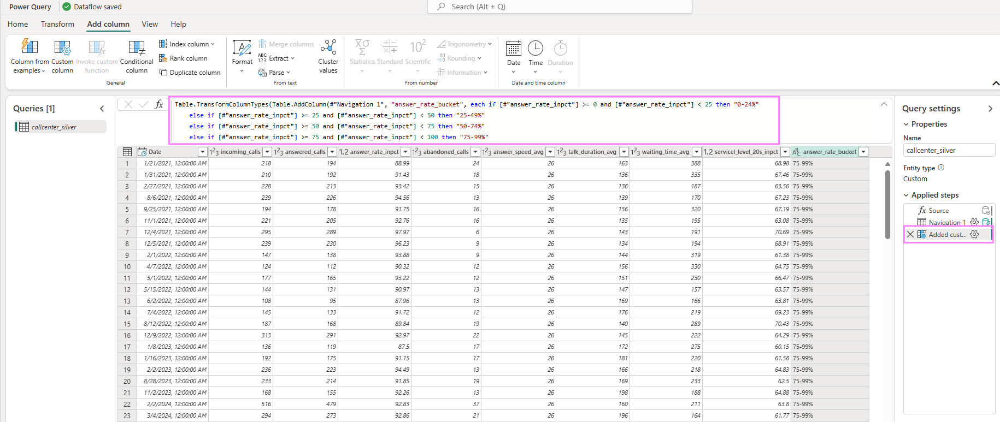

### 4. Data Transformation with Fabric Dataflowsgen2

Fabric [Dataflowsgen2](https://learn.microsoft.com/en-us/fabric/data-factory/data-factory-overview#dataflows) are part of the Fabric Data Factory workload and offer a low-code interface to ingest data from several data sources, apply data transformation with Power Query and land the processed data at various destinations, be it inside of Fabric or external destinations. Dataflowsgen2 are built on Power Query, a simple to use UI tool to apply transformations like filtering, aggregation but also data cleansing and custom transformations. Unlike the other functionality within Fabric Data Factory, [Data Pipelines](https://learn.microsoft.com/en-us/fabric/data-factory/data-factory-overview#data-pipelines), Dataflowsgen2 do not run on a Spark engine but the so-called Mashup engine. 

On the left hand side, click again on the "Create" button and find the Fabric item "Dataflows gen2". Ensure that you are in the Fabric workload on the bottom left side to be able to see under "Create" all Fabric items.


We will use the pre-processed table "callcenter_silver" that we have created in step 3 and saved in our Lakehouse "Callcenter_Lakehouse. You can rename the Dataflow on the top left side, like you did with the Notebook earlier, to have a more user-friendly name. You can see in the middle of the canvas the typical data sources to connect to. As we use the table stored in the Lakehouse and therefore in OneLake, we select "Get data from another source".


In the canvas you can either spot already in the middle your "Callcenter_Lakehouse". If not, navigate in the wizard on the left side to "OneLake" and find your Lakehouse listed there. The Dataflow then connects to your Lakehouse and displays the files and tables. Select the "callcenter_silver" table. Once you click it, a Preview wille be generated. Next, click on "Create". Hint: If you do not see your table, use the Refresh button next to "Display Options" above your Lakehouse name.


Now you see Power Query open and your table. You can spot all the data transformation acitivites at the top bar. If you like, you can now rename each column name for a friendly name for our upcoming PowerBI report. Just right-click on the column name and type the new name. As an example in the screenshot, I have renamed all columns. Spot above, that Power Query has generated in the background your visual operation into the M-language and created a formula. You can see the step on the right side where all transformation steps will be listed accordingly. This enables you to go back to previous steps or also erase some steps again.


We continue with creating a new column that will aggregate the answer rates in % into buckets. To do this, switch on the top bar to the tab "Add column" and choose "Custom column". A new window will open. Give it a new name, for example "Answer Rate Buckets" and choose "Text" from the Data type drown-down field. In the "custom column formula" field, add the following M-language formula:

```Python
if [#"Answer Rate in %"] >= 0 and [#"Answer Rate in %"] < 0.25 then "0-24%"
    else if [#"Answer Rate in %"] >= 0.25 and [#"Answer Rate in %"] < 0.5 then "25-49%"
    else if [#"Answer Rate in %"] >= 0.5 and [#"Answer Rate in %"] < 0.75 then "50-74%"
    else if [#"Answer Rate in %"] >= 0.75 and [#"Answer Rate in %"] < 1 then "75-99%"
    else if [#"Answer Rate in %"] = 1 then "100%"
    else "Other"
```




You can see the formula entered and applied in the formula canvas and the new column. The applied step is again on the right-side added.


