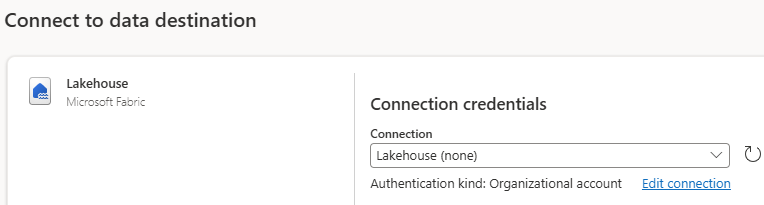

### 4. Data Transformation with Fabric Dataflowsgen2

Fabric [Dataflowsgen2](https://learn.microsoft.com/en-us/fabric/data-factory/data-factory-overview#dataflows) are part of the Fabric Data Factory workload and offer a low-code interface to ingest data from several data sources, apply data transformation with Power Query and land the processed data at various destinations, be it inside of Fabric or external destinations. Dataflowsgen2 are built on Power Query, a simple to use UI tool to apply transformations like filtering, aggregation but also data cleansing and custom transformations. Unlike the other functionality within Fabric Data Factory, [Data Pipelines](https://learn.microsoft.com/en-us/fabric/data-factory/data-factory-overview#data-pipelines), Dataflowsgen2 do not run on a Spark engine but the so-called Mashup engine. 

On the left hand side, click again on the "Create" button and find the Fabric item "Dataflows gen2". Ensure that you are in the Fabric workload on the bottom left side to be able to see under "Create" all Fabric items.


We will use the pre-processed table "callcenter_silver" that we have created in step 3 and saved in our Lakehouse "Callcenter_Lakehouse. You can rename the Dataflow on the top left side, like you did with the Notebook earlier, to have a more user-friendly name. You can see in the middle of the canvas the typical data sources to connect to. As we use the table stored in the Lakehouse and therefore in OneLake, we select "Get data from another source".


In the canvas you can either spot already in the middle your "Callcenter_Lakehouse". If not, navigate in the wizard on the left side to "OneLake" and find your Lakehouse listed there. The Dataflow then connects to your Lakehouse and displays the files and tables. Select the "callcenter_silver" table. Once you click it, a Preview wille be generated. Next, click on "Create". Hint: If you do not see your table, use the Refresh button next to "Display Options" above your Lakehouse name.


Now you see the Power Query functionalities and the first rows of your table. You can spot all the data transformation acitivites at the top bar. Any transformation that you perform, will show up as a step on the right side canvas. This enables you to go back to previous steps or also erase some steps again.

We continue with creating a new column that will aggregate the answer rates in % into buckets. To do this, switch on the top bar to the tab "Add column" and choose "Custom column". A new window will open. Give it a new name, for example "Answer Rate Buckets" and choose "Text" from the Data type drown-down field. In the "custom column formula" field, add the following M-language formula:

```Python
if [#"answer_rate_inpct"] >= 0 and [#"answer_rate_inpct"] < 25 then "0-24%"
    else if [#"answer_rate_inpct"] >= 25 and [#"answer_rate_inpct"] < 50 then "25-49%"
    else if [#"answer_rate_inpct"] >= 50 and [#"answer_rate_inpct"] < 75 then "50-74%"
    else if [#"answer_rate_inpct"] >= 75 and [#"answer_rate_inpct"] < 100 then "75-99%"
    else if [#"answer_rate_inpct"] = 1 then "100%"
    else "Other"
```


You can see the formula entered and applied in the formula canvas above and spot the data entries of your new column on the far right of your table. The applied step is again on the right-side in the canvas added.


We have now a curated table that we can use for PowerBI reporting. Let's first save the table with all applied steps again in our Lakehouse. As delta parquet is the native format for tabular data in Fabric, it will be saved in that format automatically. To do so, find on the right at the bottom the "Destination" section, click on the "+" icon and select "Lakehouse".


As you have connected already to the Lakehouse with the dataflow before, the same lakehouse connection should be set up automatically as shown here. Click on "Next" at the bottom right.




Choose the "Callcenter_Lakehouse" and ensure that we will create a new table. Adjust the table name to "callcenter_reporting" and click "Next" at the bottom right.


Ensure the toggle "Use automatic settings" is enabled and click on "save settings" at the bottom right again. 


Now we need to publish the dataflow. On the bottom right where you added in the previous step the destination, you will find the button "Publish". On the arrow you can see to publish it right away or add a schedule for it. Let's publish now to have the table being processed and stored right away in our Lakehouse.


After publishing you will be redirected to your workspace and where you can see all artifacts we have created in Fabric. You see the just published dataflow "callcenter dataflow" running.


