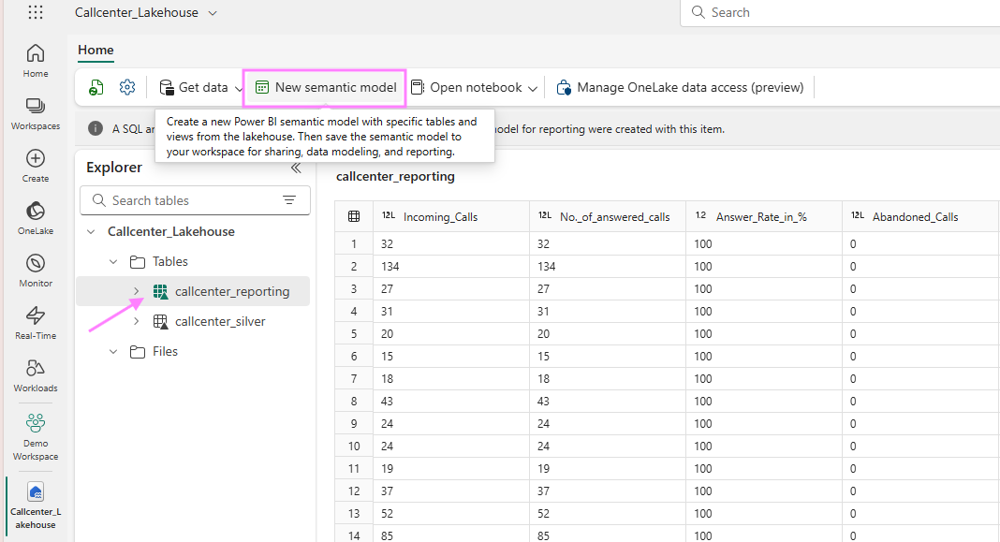

### Create a PowerBI report 

Once the dataflow from step 4 has finished running, in your Fabric workspace overview where you see all Fabric items created, select the "Callcenter_Lakehouse" to open.

You might see under your table "callcenter_silver" a folder "Unidentified". Click on the 3 dots next to it to refresh, or refresh the entire Lakehouse further above.

You should see now your table "callcenter_reporting". Click on it and on "New semantic model"

Give the semantic model a name and choose the table "callcenter_reporting". Click on confirm and you will land on der PowerBI report authoring experience.

