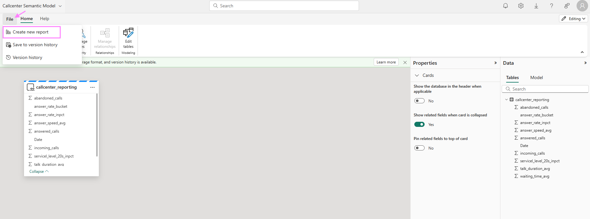
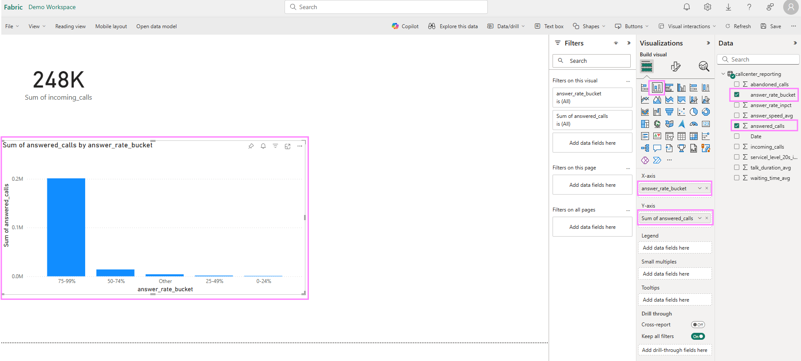

### Create a PowerBI report 

Once the dataflow from step 4 has finished running, in your Fabric workspace overview where you see all Fabric items created, select the "Callcenter_Lakehouse" to open.

You might see under your table "callcenter_silver" a folder "Unidentified". Click on the 3 dots next to it to refresh, or refresh the entire Lakehouse further above.

You should see now your table "callcenter_reporting". Click on it and on "New semantic model"

Give the semantic model a name and choose the table "callcenter_reporting". Click on confirm and you will land on semantic model authoring experience.  

!! Attention: If your browser has Pop-Up blocked, a new Window for creating a PowerBI Report will not open. You can then navigate to your Workspace (on the left side click on Demo Workspace or whichever name you gave in step 0.prerequisites") to find all Fabric items. There you will be able to see your Callcenter Semantic Model. Click on it and select under the button "Explore this data" to create a new report

#### Create PowerBI Visuals

Feel free to create some visuals if you are familiar with PowerBI. Otherwise, as an example, you can select on the right from the visualization options the "Card Tile" and drag from the Data Pane on the very far right the "incoming calls" into the visual field like shown in the screenshot.

We can also create a column chart to see the relationship between the numbers of answered calls by the answer rate buckets. Select the "stacked column chart" visual and drag the "Answer Rate Buckets" from the Data Pane into the x-axis field for the visual and the "No of answered calls" into the y-axis. We can identify that the biggest part of the answered calls were answered in a 75-99% answer rate.

Now you can further explore some other visuals and drag respective data fields to retrieve more information out of your dataset.
