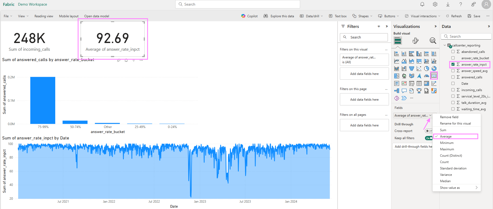

### Create a PowerBI report 

Once the dataflow from step 4 has finished running, in your Fabric workspace overview where you see all Fabric items created, select the "Callcenter_Lakehouse" to open.

You might see under your table "callcenter_silver" a folder "Unidentified". Click on the 3 dots next to it to refresh, or refresh the entire Lakehouse further above.

You should see now your table "callcenter_reporting". Click on it and on "New semantic model"

Give the semantic model a name and choose the table "callcenter_reporting". Click on confirm and you will land on semantic model authoring experience.  

!! Attention: If your browser has Pop-Up blocked, a new Window for creating a PowerBI Report will not open. You can then navigate to your Workspace (on the left side click on Demo Workspace or whichever name you gave in step 0.prerequisites") to find all Fabric items. There you will be able to see your Callcenter Semantic Model. Click on it and select under the button "Explore this data" to create a new report

#### Create PowerBI Visuals

Feel free to create some visuals if you are familiar with PowerBI. Otherwise, as an example, you can select on the right from the visualization options the "Card Tile" and drag from the Data Pane on the very far right the "incoming calls" field into the visual field like shown in the screenshot. We have 248k incoming calls in our dataset.

We can also create a column chart to see the relationship between the numbers of answered calls by the answer rate buckets. Select the "stacked column chart" visual and drag the "Answer Rate Buckets" from the Data Pane into the x-axis field for the visual and the "No of answered calls" into the y-axis. We can identify that the biggest part of the answered calls were answered in a 75-99% answer rate.

Let's add some more visuals: 
We create a time series plot to look for any anomalies for our answer rate. We select the area chart from the visual options and drag the "Date" field from our data pane into the "x-axis" field and "Answer_Rate_in_%" into the "y-axis" field. You can expand the visual in the canvas further to the right to make it bigger and spot that we have a drop in our answer rate right before January 2023.

Lastly, we create another "card visual" and select again "Answer_Rate_in_%" into the field. We change with the arrow from the automatically chosen "Sum" to "Average". We can see that our service center answered on average the support call with a 92.69% answer rate.

