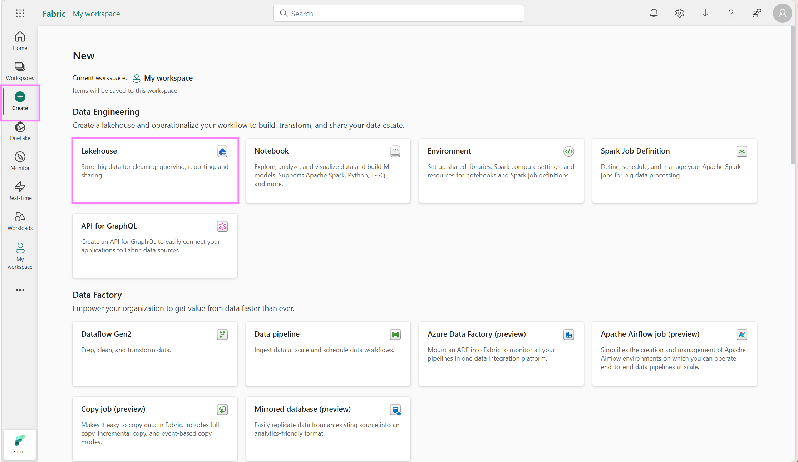
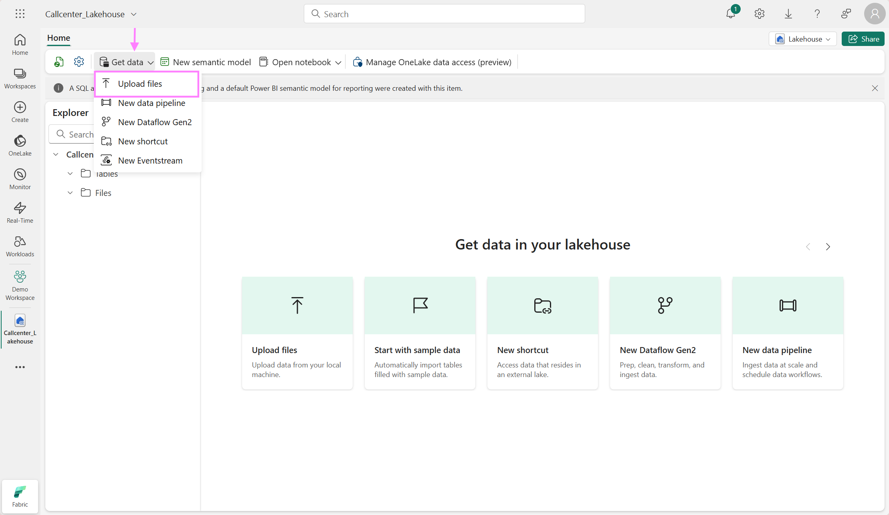
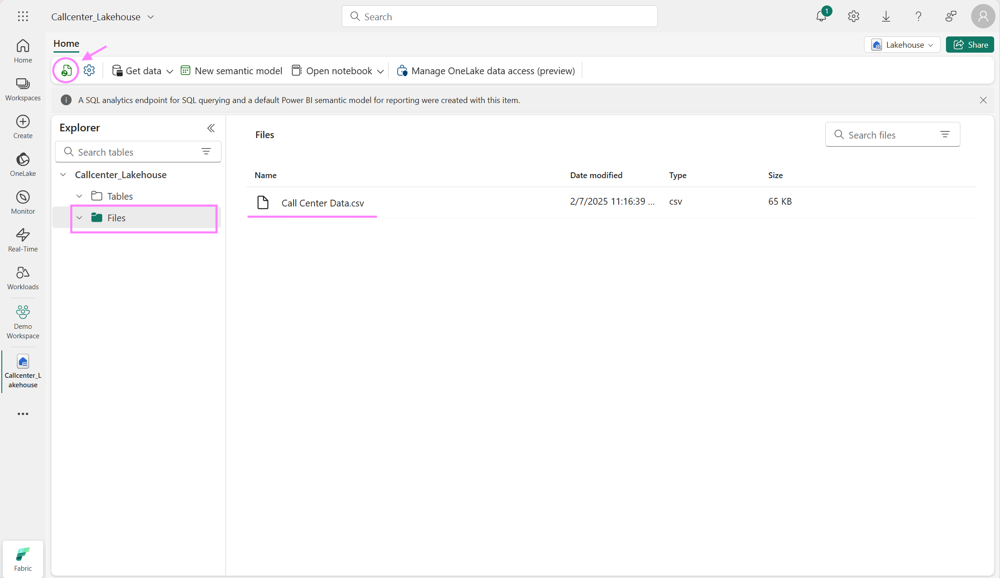

## Prerequisites
- Download the free and public available [Call Center dataset](https://www.kaggle.com/datasets/satvicoder/call-center-data?resource=download) from Kaggle
- You need a Microsoft Fabric subscription or sign up for a free [Microsoft Fabric (Preview) trial](https://learn.microsoft.com/en-gb/fabric/enterprise/licenses)
- Sign in to [Microsoft Fabric](https://fabric.microsoft.com/)
- Use an existing Microsoft Fabric Lakehouse or create a new once by following the steps in this [tutorial](https://learn.microsoft.com/en-gb/fabric/data-engineering/create-lakehouse)

## Step by Step guide for customer service analysis n Fabric
### 1. Load Data 
Data Engineers commonly use the [Fabric Data Factory](https://learn.microsoft.com/en-us/fabric/get-started/fabric-trial) section to ingest, prepare and transform data from various data sources and land it into OneLake. In our example, we will upload a local file directly into the Lakehouse.

From fabric.microsoft.com, navigate on the left side and click on "Create" which will open up the page from where you see all items you can create in Fabric. Click on Lakehouse, enter the new name "Callcenter_Lakehouse", leave the "Lakehouse schema" option un-checked and click create.
     


Find under the Home Tab "Get Data" and select "Upload files" as shown in the screenshot below. Browse for the folder where you have stored the downloaded file from Kaggle in the ####Prerequisite step and upload it to the Lakehouse. If you haven't done this yet, download [Call Center dataset](https://www.kaggle.com/datasets/satvicoder/call-center-data?resource=download) from Kaggle now. 
     


Verify that the data is uploaded successuflly by clicking the "Refresh" icon on the top left and locate the csv file under the "Files" section. As the file is in csv format, it is stored under the "Files" section instead of the "table" section. The File section can contain various file formats like csvs, images, jsons and more. The "Table" section contains recognized delta parquet tables. 


   
### 2. Process Data
Once the data is uploaded, it can be used and processed by other engines within Fabric, e.g. the SQL engine in the Data Warehouse workload or the KQL engine in the Real-Time Analytics workload etc. For example, merging and pre-processing different dataset can be achieved with code in a Spark Notebook inside the [Synapse Data Engineering experience](https://learn.microsoft.com/en-us/fabric/data-engineering/data-engineering-overview) and/or via the no-/low-code approach of Data Flows Gen2 insith the [Data Factory workload](https://learn.microsoft.com/en-us/fabric/data-factory/create-first-dataflow-gen2). We will first process the csv file of "File" section and then load it into a table into the "Table" section with a Spark Notebook. 

Create a Notebook


Make sure your Lakehouse is attached and you selected PySpark (Python) as the language


Insert and run the following code

```Python
#import pandas and read the call center csv file from the Lakehouse
import pandas as pd

cc = pd.read_csv("/lakehouse/default/" + "Files/Call Center Data.csv")
cc.head(5)

#renaming columns to exclude spaces
cc = cc.rename(columns= {"Incoming Calls": "incoming_calls", "Answered Calls": "answered_calls", "Answer Rate": "answer_rate", "Abandoned Calls": "abandoned_calls", "Answer Speed (AVG)": "answer_speed_avg", "Talk Duration (AVG)": "talk_duration_avg", "Waiting Time (AVG)": "waiting_time_avg", "Service Level (20 Seconds)": "servicel_level_20s"})

#drop Index column as it is unnecessary for further analysis in this case
cc = cc.drop(columns= ["Index"])

# Convert the columns with datetime information to datetime values 
cc_time = cc.copy()
cc_time[["answer_speed_avg", "talk_duration_avg", "waiting_time_avg"]] = cc_time[["answer_speed_avg", "talk_duration_avg", "waiting_time_avg"]].apply(pd.to_datetime, errors= "coerce")

#Create Spark Dataframe and write it back to the Lakehouse Tables section for PBI reporting later on
sparkDF = spark.createDataFrame(cc_time)
sparkDF.write.mode("overwrite").format("delta").save("Tables/" + "callcenter_processed")
```

Verify that the file was succeffully written in the table section by clicking on the three dots next to "Tables" and hit "Refresh"


### 3. Perform some Exploratory Data Analysis
Let's continue with some EDA to better understand the data and retrieve some insights. You can stay in the current notebook, add the following code and run it:

```Python
#check the data types to get an overview
cc_time.dtypes

#check for null values
cc_time.isnull().sum()

#Converting datetime values into decimals for the hours, minutes, and seconds in order to have useable statistical (float) data 
cc_timefloat = cc_time.copy()
cc_timefloat['answer_speed_avg'] =  cc_timefloat['answer_speed_avg'].dt.hour * 60 + cc_timefloat['answer_speed_avg'].dt.minute + cc_timefloat['answer_speed_avg'].dt.second/60
cc_timefloat['talk_duration_avg'] = cc_timefloat['talk_duration_avg'].dt.hour * 60 + cc_timefloat['talk_duration_avg'].dt.minute + cc_timefloat['talk_duration_avg'].dt.second/60
cc_timefloat['waiting_time_avg'] = cc_timefloat['waiting_time_avg'].dt.hour * 60 + cc_timefloat['waiting_time_avg'].dt.minute + cc_timefloat['waiting_time_avg'].dt.second/60

#create a correlation matrix to understand how the parameters impact each other
import seaborn as sns
from matplotlib import pyplot as plt
plt.figure(figsize=(15,10)) 
sns.color_palette("dark", as_cmap=True)
sns.heatmap(cc_timefloat.corr(), annot=True, cmap='coolwarm', center = 0)

```
### 4. Data Transformation with DataFlow Gen2 
We will now make use of the no-/low-code ETL feature inside of "Data Factory" to create a new column. Navigate on the bottom left to the Data Factory workload and click on new DataFlow Gen2


Now we need to connect to our call center data we stored in the Table section in our Lakehouse. Click on "get data from a different source"


Type in the search bar "Lakehouse" and click on the Lakehouse beta connector. Use the authentication kind "Organizational Account", sign in and click next.


Navigate on the left to your Fabric Workspace > your Lakehouse (in my case CallCenter_LH) and select the callcenter_processed dataset and click create


Now, we want to change the data type of the column "answer_rate" to decimal. Right-click on the column name, go to "change type" and click "decimal number". You will see on the right side in the Query settings field, that this step has been added.


We will create a new column, "answer_rate_bucket", that will assign 4 different categories depending on the input from our column "answer_rate". Navigate at the tab bar to "Add column", then select "custom column" and a window will open. Change the name of the column we want to create to "answer_rate_bucket", change the Type to "Text" and add the following code into the field
```Python
if [answer_rate] >= 0 and [answer_rate] < 0.25 then "0-24%"
    else if [answer_rate] >= 0.25 and [answer_rate] < 0.5 then "25-49%"
    else if [answer_rate] >= 0.5 and [answer_rate] < 0.75 then "50-74%"
    else if [answer_rate] >= 0.75 and [answer_rate] < 1 then "75-99%"
    else if [answer_rate] = 1 then "100%"
    else "Other"
```


Verify that the step (custom column) has been added to the flow and you can see also the column in the data preview with inputs. Now we bring this data back to the Lakehouse. On the right bottom click to add a data destination and select "Lakehouse"


Follow the wizward to authenticate the same way you did for connecting to the data source Lakehouse earlier (beginning of Step 4). Now we will bring the data into a new table in the same Lakehouse but with a different name so we can later on identify the dataset.


Click on next and keep the settings are they are (Update method = replace) and the source types should be correctly identified. Click on save settings. Back on the Power Query screen, locate on the bottom right the "Publish" button and click to publish now.


### 5. Create PowerBI Report
With Microsoft Fabric PowerBI, a new connection mode has been introduced: [Direct Lake Mode]([https://learn.microsoft.com/en-us/fabric/data-engineering/lakehouse-pbi-reporting](https://learn.microsoft.com/en-us/power-bi/enterprise/directlake-overview)). This capability allows very fast BI visualization on large datasets by loading parquet files directly from the Data Lake into the PBI engine, without the necessity to query a Lakehouse endpoint nor importing data into a PowerBI dataset. In order to create a Direct Lake dataset, we need to go back to our Lakehouse we have been working on in the previous steps (switch back on the left bottom to the Data Engineering icon and select your Lakehouse). From there you should verify that your table transformed in Step 4 with Dataflows Gen2 has been saved. 

Next, click on "New Power BI dataset" and select the table that has been created after Step 4 from the Dataflow transformation (you can verify by spotting the "answer_rate_bucket" column) and click "confirm". 


Now we would have the opportunity to do some data modelling and create relationships between several tables. In this case, we skip it as we just have one table and click on "New Report"


By expanding the table on the right side in PowerBI, you can see all the columns. Just by clicking on "answer_rate_bucket" and "answered calls", automatically a visual table is created. Feel free to explore and create further tiles to explore the data


